# Final Assembly

You will need:

* the left arm assembled
* the right arm assembled
* the torso assembled
* the left leg assembled
* the right leg assembled
* the head assembled
* the left shoulder 3D printed part
* the right shoulder 3D printed part
* the pelvis 3D printed part
* 2 Dynamixel XL-320 with IDs 11 and 21
* 44 2-step OLLO rivets
* 5 3-step OLLO rivets

We will start by connecting the arms to the torso. First place the left shoulder part onto the servo 41 that is in the torso and secure it with 4 rivets:

Straighten the shoulder in neutral position and then position the left arm into the shoulder as seen in the picture bellow. Secure it with 4 rivets on the horn side:

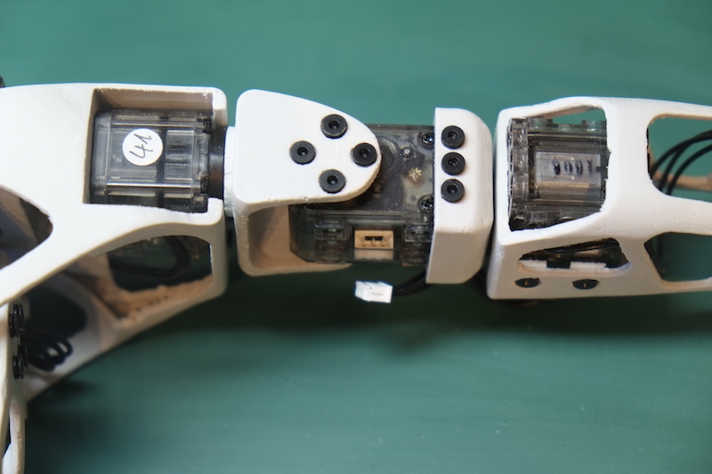

And one 3-step rivet on the idle side:

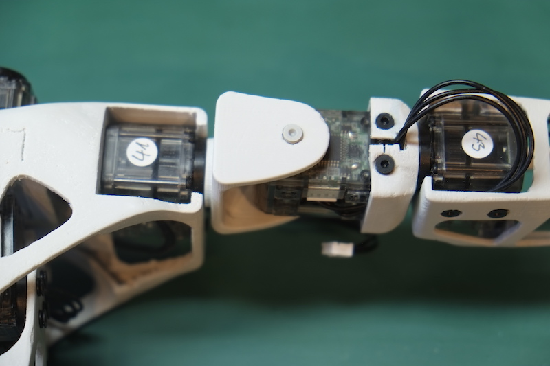

Connect the cable left from the shoulder_y in the torso to the spare connector on the interior of the arm as seen in the picture:

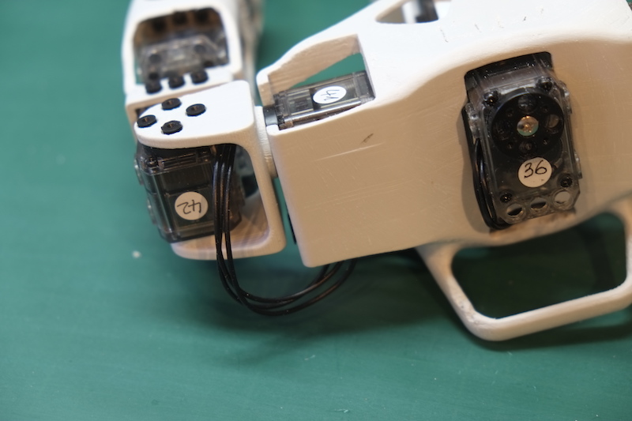

Move around the arm and make sure that the cable does not come in the way of the other parts of the arm.

We will repeat the process for the right side. First secure the right shoulder part using 4 rivets:

The bring it in neutral position and connect the right arm using 4 rivets on the horn side:

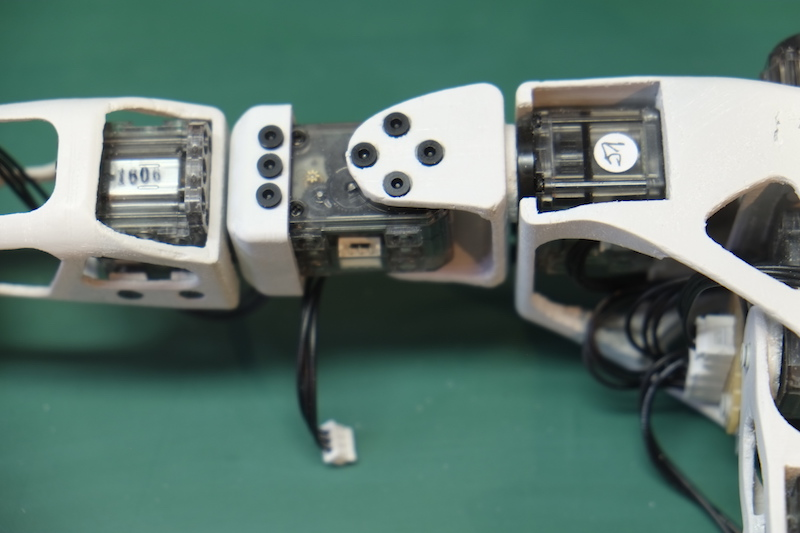

And one 3-step rivet on the idle side:

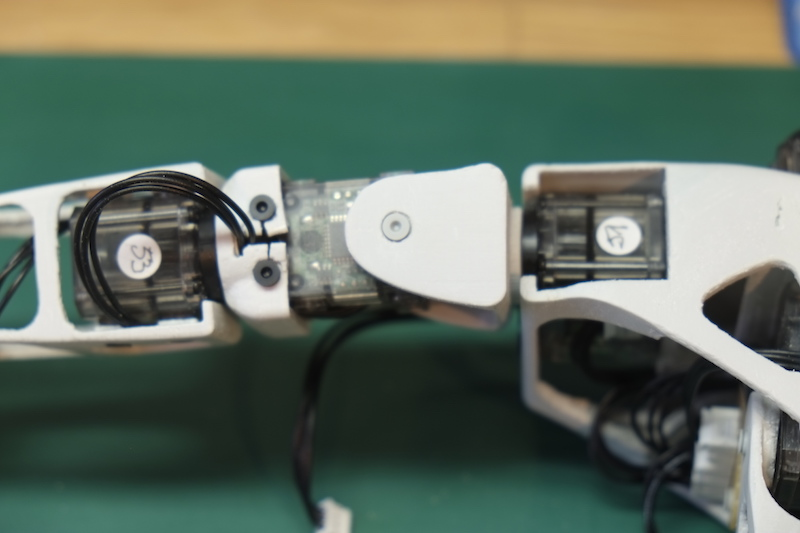

Connect the cable from the servo in the torso to the inside of the arm servo as before:

Place the assembled head on the top servo (ID 36) of the torso and secure it in place with 4 rivets:

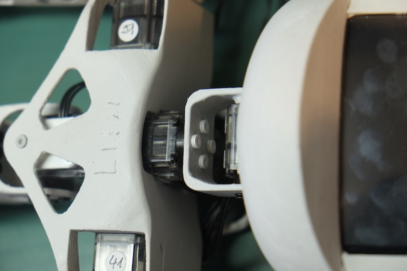

Connect the shorter XL cable from the head_y servo (37) to the remaining connector in the head z (36):

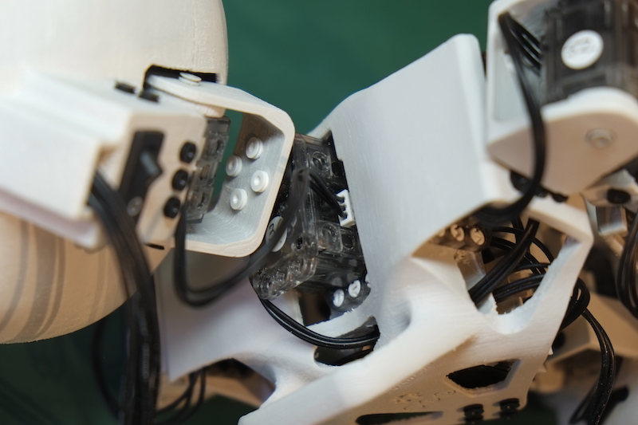

Guide the 300mm XL cable (the shorter one of the two) through the space on one side of the head_z servo (36) so that it arives in the upper part of the torso:

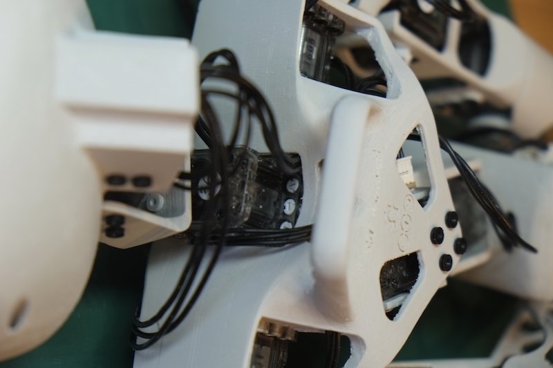

And connect it in the remaining slot in the upper hub in the torso:

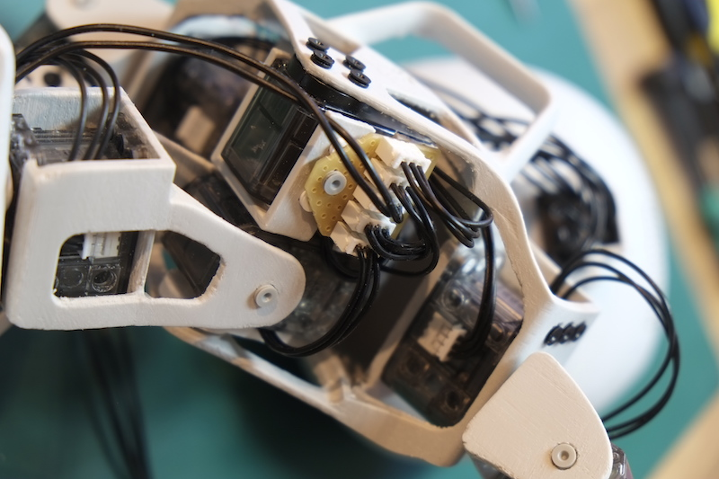

Guide the longer 400mm XL cable through the space on the other side of the head_z servo:

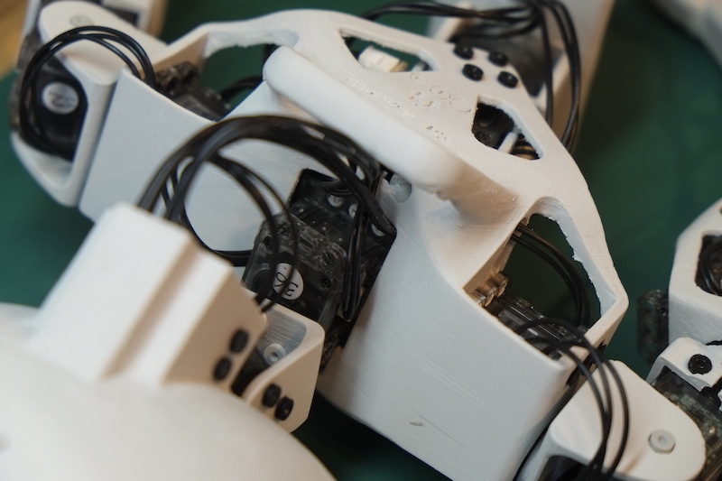

And through the hole in the abdomen:

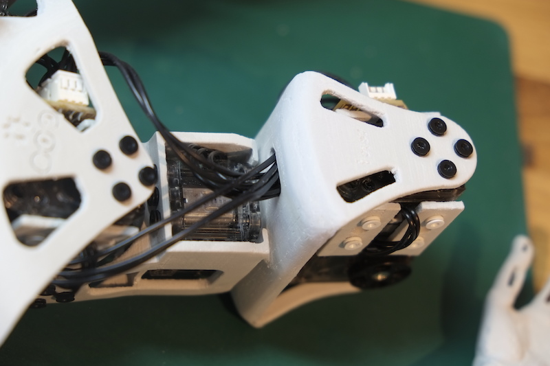

And connect the cable to the empty slot on one side - leaving two slots one next to the other on the other side. These will be used for the buses to the legs:

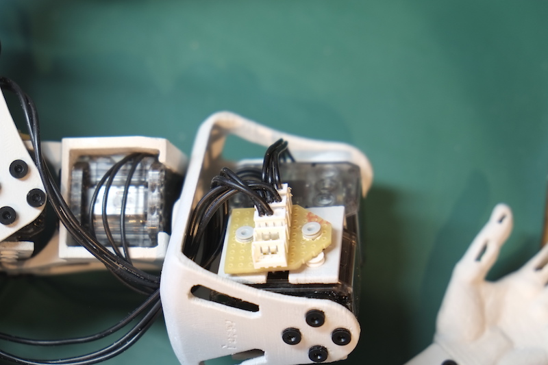

We will start now to assamble the legs. Take the XL-320 with ID 11 and place a normal cable as in the following picture:

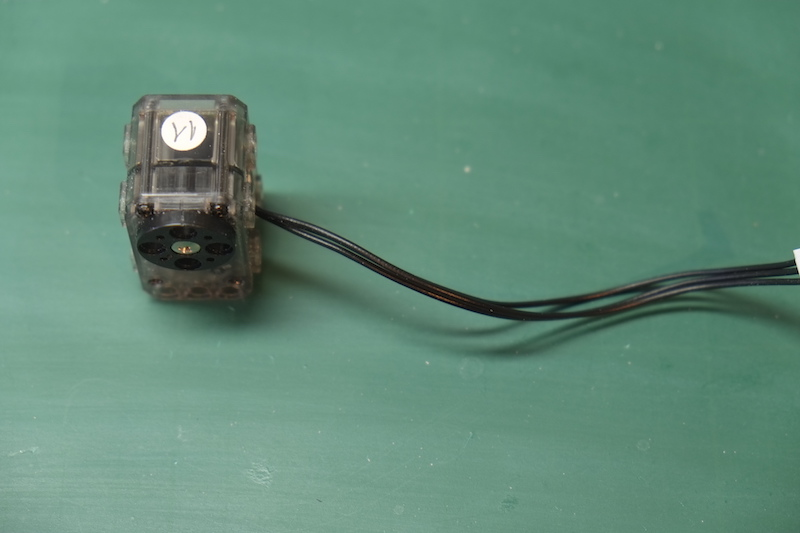

Slide the servo in the pelvis as seen in the picture and secure it with 3 rivets. The cable should be on the outside part:

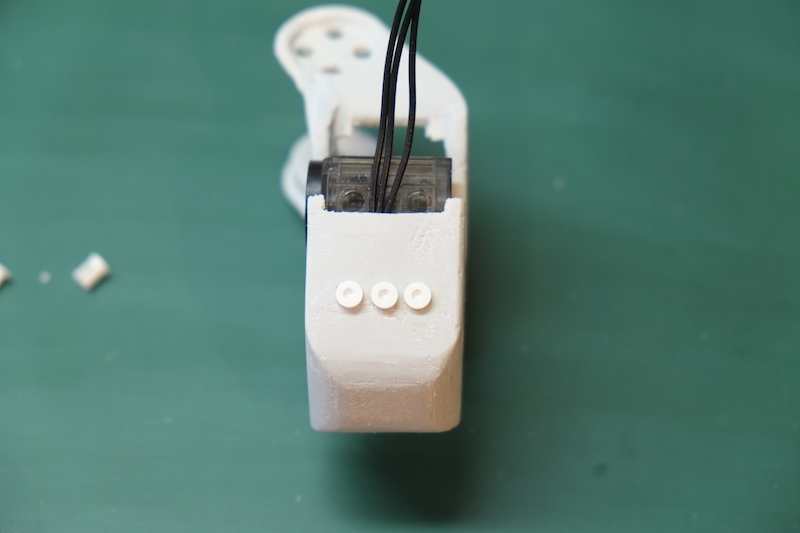

Add 3 more rivets on the back of the pelvis:

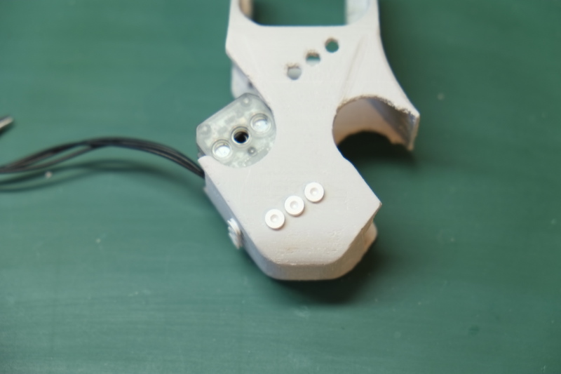

Make sure that the servo is in 0 position. Take the left leg and position it as tight as possible against the pelvis so that you can fix it with 4 rivets as seen in the picture:

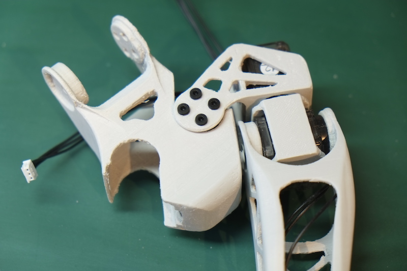

And one 3-step rivet on the idle side:

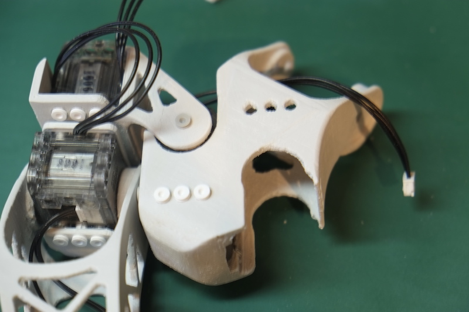

Connect the cable from the leg to the remaining connector in the servo in the pelvis as shown in the picture:

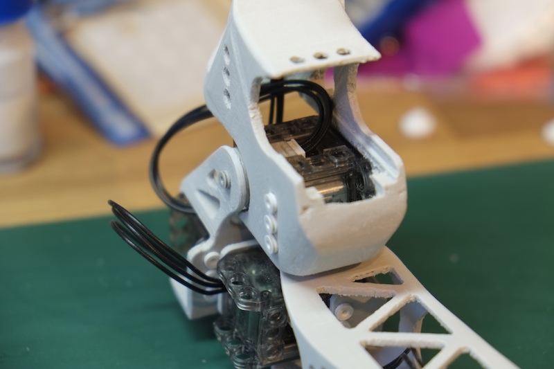

Move the leg around and make sure that the cables do not come in the way.

Take the servo 21 and connect a standard cable as seen in the picture:

Take the right leg and connect the cable coming from this leg to the remaining connector in the servo 21 making sure that the cable is going through the pelvis as shown in the following picture:

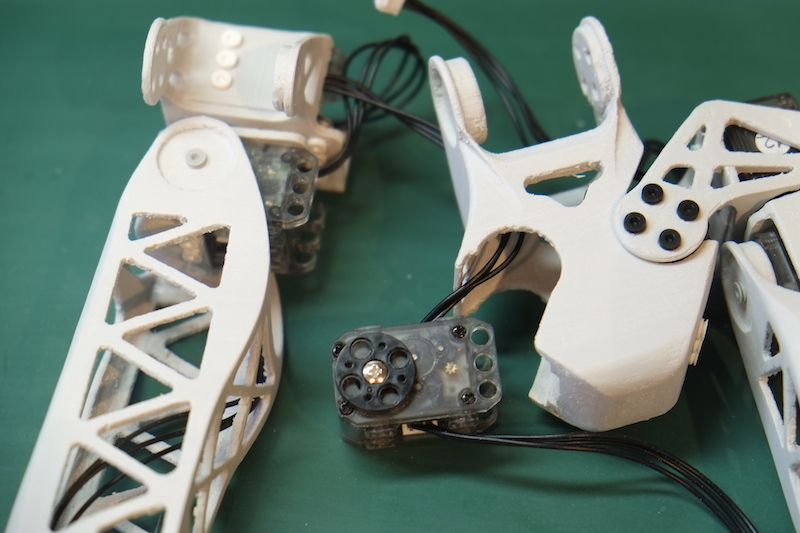

Guide both cables up and slide the servo into the pelvis, then secure it with 3 rivets on the side:

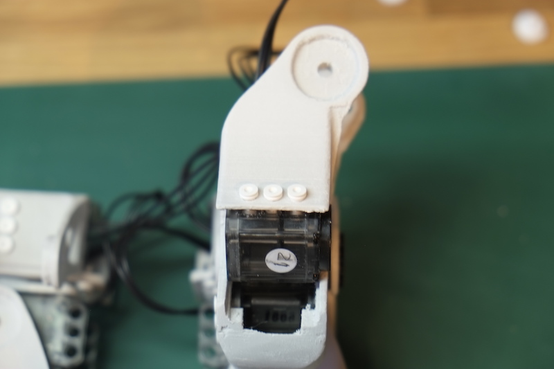

Add 3 more rivets on the back:

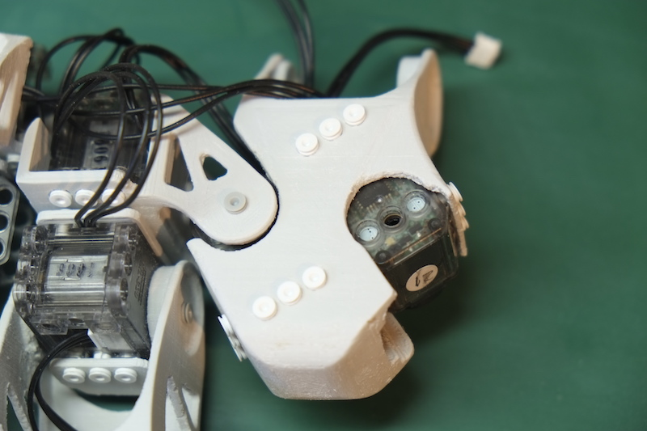

Make sure the servo 21 should be in 0 position. Position the right leg on the servo so that you can secure it with 4 rivets. It will be pointing towards left as you look directly at the assembly:

And one more 3-step rivet on the idle side:

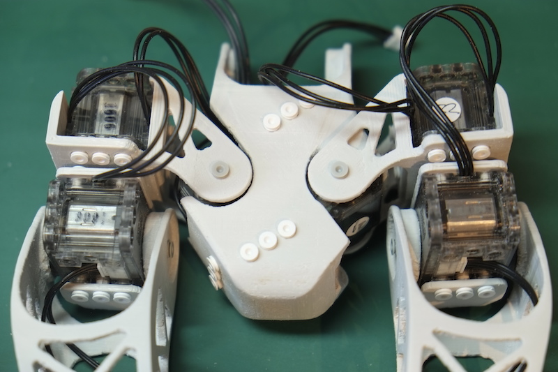

Place the lower torso into the pelvis supports and secure it with 4 rivets:

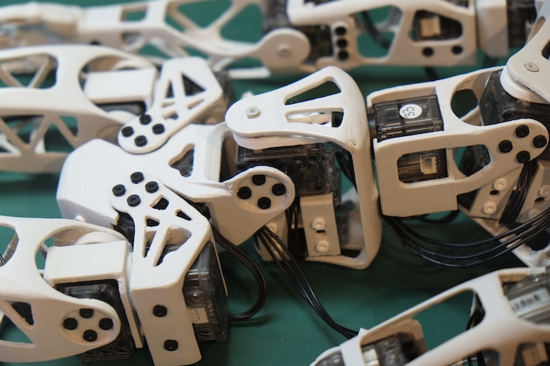

Plus one more 3-step rivet on the idle side (that's the last rivet!)

Connect the two cables from the legs to the hub in the lower torso:

And we're done! Poppy Seed is now complete:

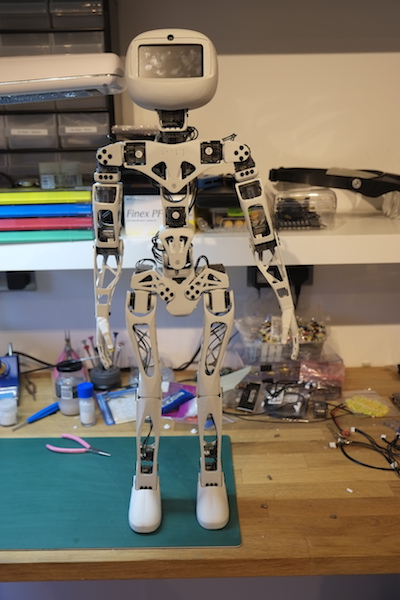
