# Head Assembly

For the assembly of the head you will need the following parts and fixings:

* Head front 3D printed part
* Head back 3D printed part
* Neck 3D printed part
* 2 x spacers 3D printed parts - these are used to support the eletronics inside the head without needing screws; they are made so that you can adjust and print them using the particular settings of your electronics, without needing to reprint the whole back head
* 2 surface guards 10mm bumbers
* 3 2mm heat inserts (I've been using these for a while and I quite like this approach; the ones I use are produced by TR Fastenings in UK, but there are many sellers on eBay - just search for "heat sert". If the community finds it hard to use these heat serts we can produce a variant of the front head that might use normal hex nuts).
* 3 M2x12mm screws (I'm using Allen screws but any would do)
* 4 [M2x12mm F-F standoffs](http://www.ebay.co.uk/sch/i.html?_from=R40&_trksid=m570.l1313&_nkw=f-f+m2+standoff&_sacat=0) 
* 2 M2x15mm M-F standoffs
* 6 M2x6mm screws
* 11 2-step OLLO rivets
* 1 3-step OLLO rivet
* One XL-320 servo with ID 37
* One standard XL Dynanmixel cable

You would also need to have the following electornics prepared (follow the guides in the [Electronics](https://github.com/sonelu/poppy-seed/tree/master/hardware/electronics) section about preparing them):

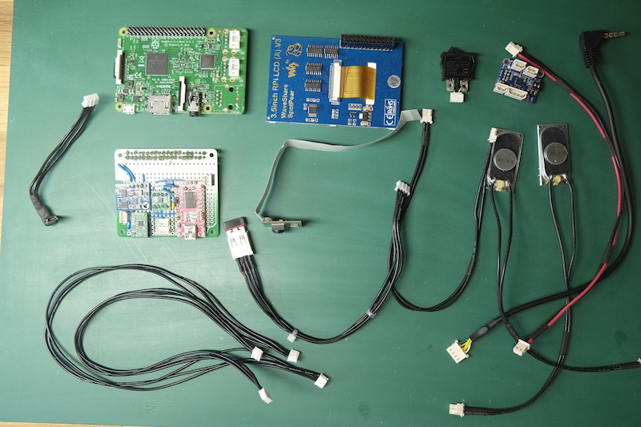

* One "Diet" Raspberry Pi 3
* One 3.5inch LCD from Waveshare
* One interface board that includes the Dynamixel bus adapter, power regulator and a 9DOF IMU
* One 2x2W power amplifiers from Adafruit, model [1552](https://www.adafruit.com/products/1552)
* One Raspberry Pi camera
* Two 20x40 speakers with cables and connectors (you can choose a different way to connect the speakers to the aplifier board - but it makes it easier to assemble and dissassemble the head if they have connectors)
* A custom USB cable that can connect to the JST plugs on the on the Slim Raspberry Pi board and has a normal USB B socket on the other side
* One WiFi dongle (that you know for sure works with Raspberry Pi); we will use the built in WiFi to create an access point (thus allowing us to connect from another computer to the Poppy no matter where we are located and if there is a WiFi or not) and this second WiFi we will use to connect to an exiting WiFi network. We will activate NAT so that Poppy will act as a normal access point when connected to another WiFi.
* One power switch; the model I use is from Maplin [N19CL](http://www.maplin.co.uk/p/slim-line-rocker-switch-n19cl) but there are other producers with the same characteristics
* A set of other custom cables: 1 two wires for the power of the audio amplifier, 1 two wires for the connection of the switch, one audio jack (stereo 3.5mm) to 4 pin MOLEX for the audio amplifier and 1 Mini USB to JST for the connection of the FT232 serial board that is used for the Dynamixel bus. All these cables are dependent on what connectors you decide to use (if any) on the boards but I strongly recommend you to use connectors at least on one of the sides of the cable in case you want to solder the other side on the boards
* One 300mm Dynamixel XL cable (custom made)
* One 400mm Dynamixel XL cable (custom made)

First we will need to put in place the 3 heat serts in the front head in the 3 holes avaialable. Use a soldering iron set to about 170 degrees Celsius and make sure that the heat sert is positioned sqare with the face of the hole and do not apply pressure; let the the heat sert sunk into the plastic slowly until is flush with the hole face:

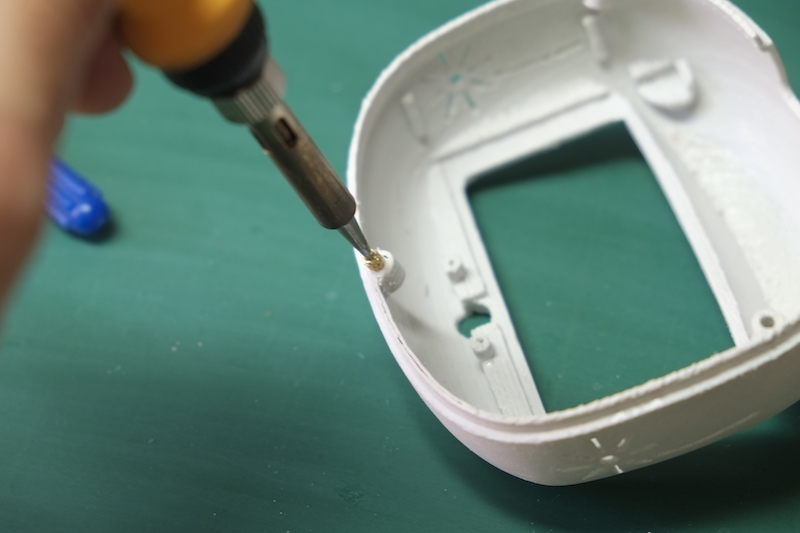

Once you place all three heat serts into the head it would be a good idea to use the three screws and mount the front and the back of the head making sure that the screws work fine and that there was no misalignment of the axes:

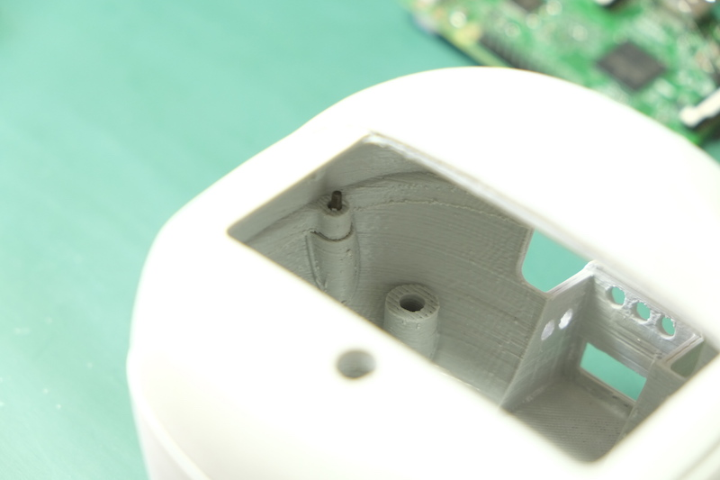

Place now the 3.5inch Waveshare LCD screen into the head front with the pin header connector positioned towards the lower part of the head. The screen should fit just enough in the frame without needing too much preasure, but also without being loose:

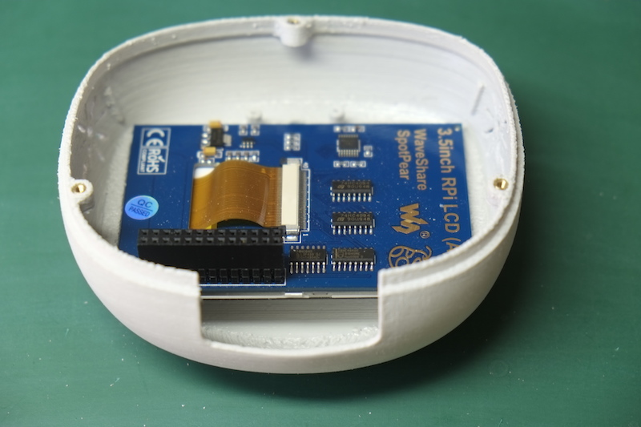

Check on the front that there is no gaps left between the screen and the inside edges of the frame. If there is a gap this indicates that the screen did not sit properly in the frame and you should check if there are parts or leftovers from printing that are in the way.

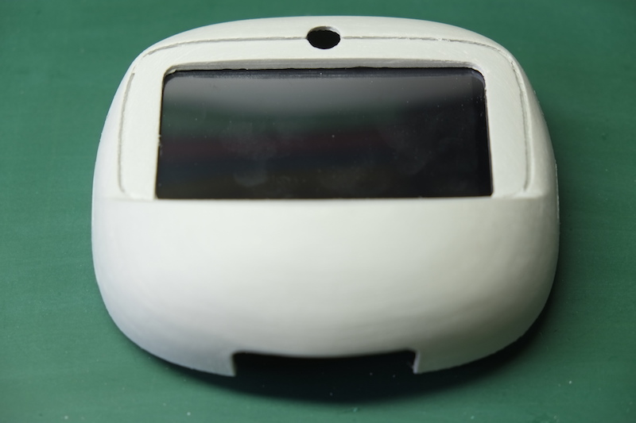

Place a few centimeters of isolation band on the LCD board in the centre between the two pillars that will hold the camera. This is to make sure that the two board do not produce any shorts:

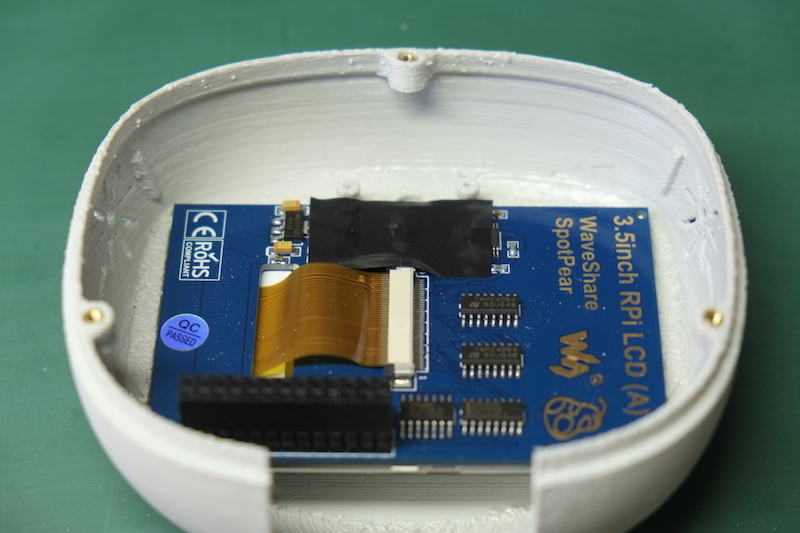

Now place the Raspberry Pi camera over the LCD screen and the isolation band and secure it in position using two M2x4mm self tap screws:

Place the two speakers in the sides of the head. They should fit snugly between the two supports and you will have to use a little bit of pressure to have them sit in place.

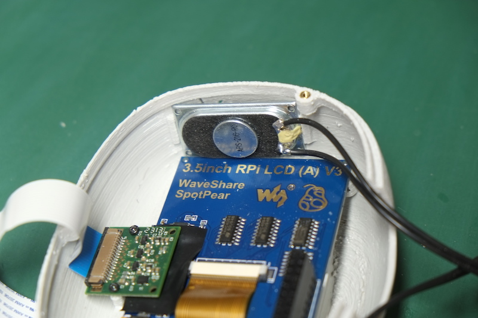

Now we'll prepare the HAT board by connecting all the cables to it: the 2 custom Dynammixel cables (30 and 40cm) will go to the XL connectors, the power cable and the switch cable onto their dedicated connectors:

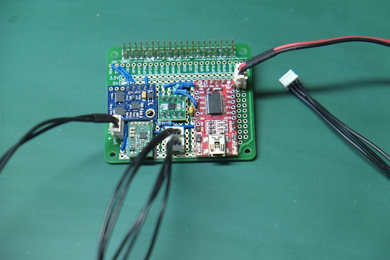

Connect two M-F 15mm standoffs and two F-F 12mm standoffs as in the picture bellow in the holes opposite the GPIO on the Raspberry Pi. The long standoffs are on the front of the board, the short ones on the back of the board:

Connect the remaining F-F 12mm standoffs in the holes next to the GPIO on the back of the board using 2 M2x6mm screws:

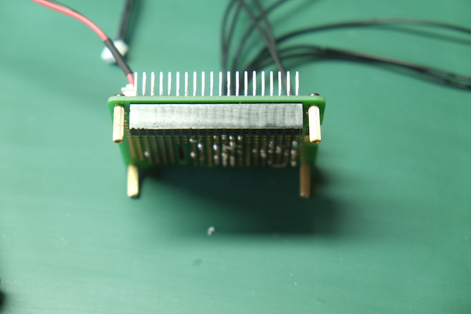

Place the HAT board onto the LCD screen making sure the pins are corectly alligned (the HAT has 2x20 and the screen has 2x13 - you need to make sure that the outside pins are properly aligned). The pin header on the LCD will limit the ditance on that side while the 15mm standoffs will limit the position of the HAT in respect to the screen:

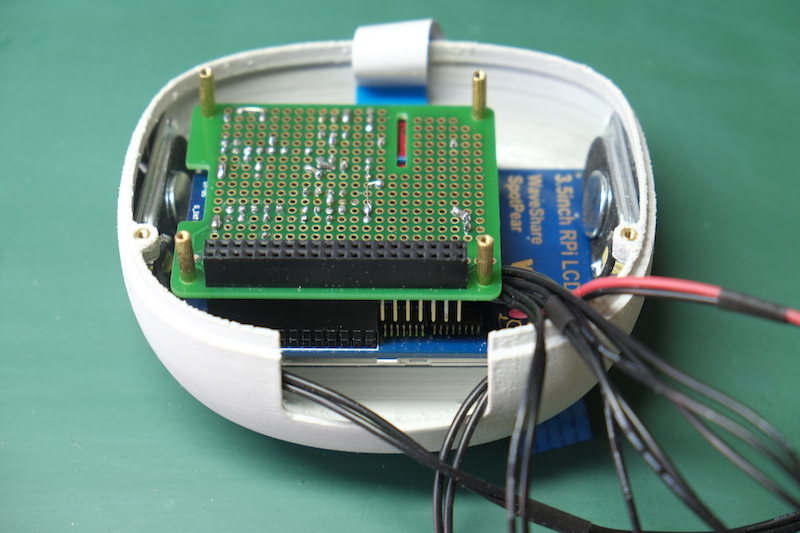

Add the custom USB cable into the mini USB connector on the FT232 board:

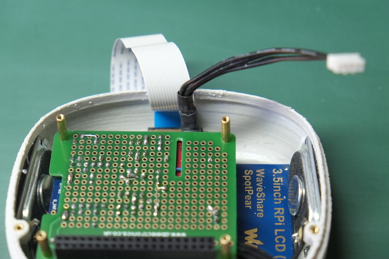

Connect this cable to the USB connector in the middle on the front of the Raspberry Pi and also connect the flat ribbon from the camera to the camera connector:

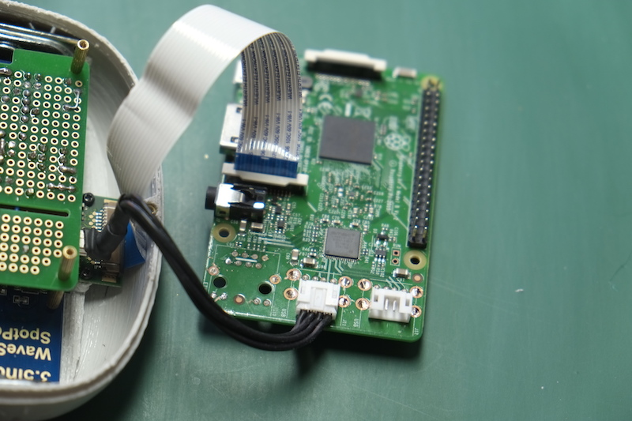

Carefully place the Raspberry Pi on top of the HAT board making sure the GPIO connector is aligned properly and taking care of the camera ribbon:

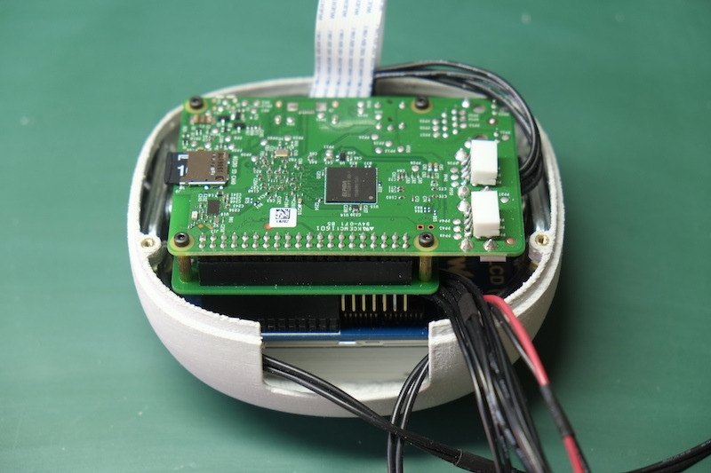

Take the custom USB dongle cable and place the USB female connector in one of the supports in the head back. It should slide relatively easy as long as you make sure there are no leftovers from the 3D printing process in that support:

Place the WiFi dongle in the USB connector:

Mount the power amplifier using 2 M2x4mm self tap screws at the back of the head:

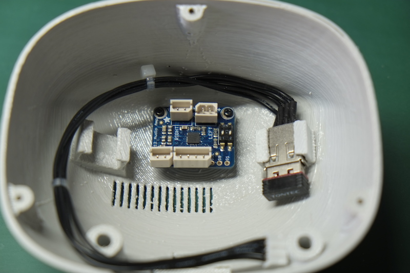

Slide the switch into its place at the back of the neck:

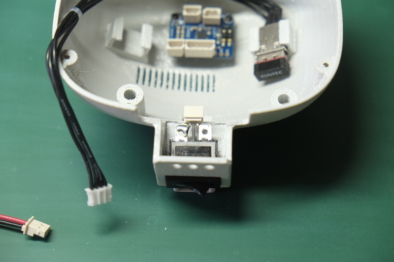

Use two 10mm round guards and stick them onto the spacers (they are self adhesive):

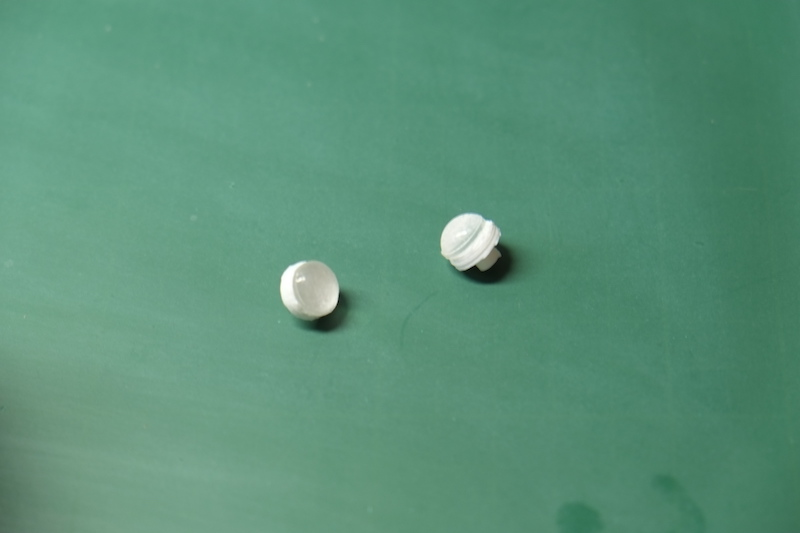

And place these spacers in the holes in the head back:

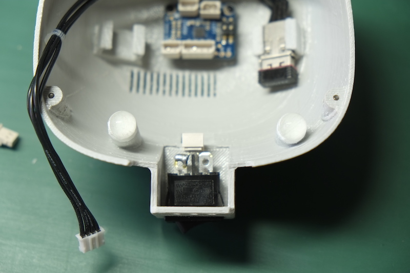

Take the XL-320 servo (id 37) and connect it to the neck 3D part as in the picture using 4 rivets. Add a standard XL cable on the undersidide:

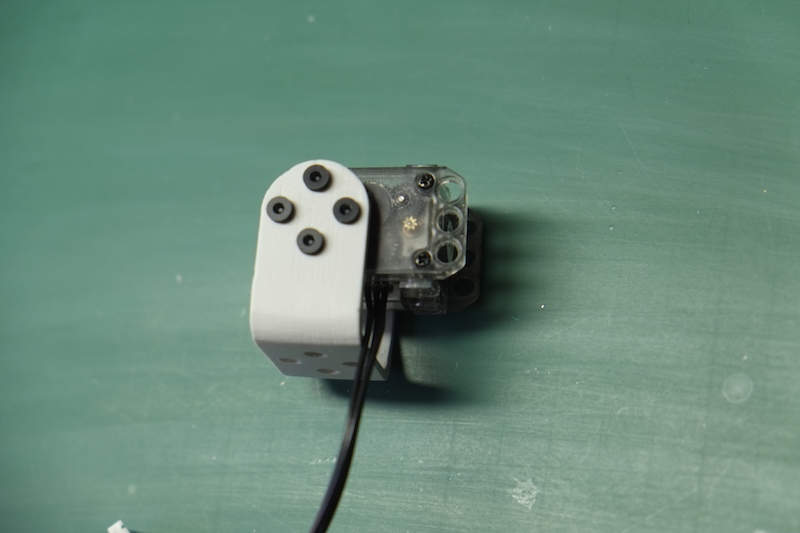

And one 3-step rivet on the other side:

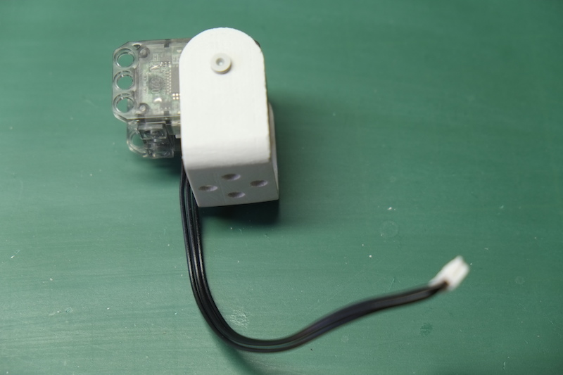

Now slide the servo into the neck back and secure it with 3 rivets on the underside:

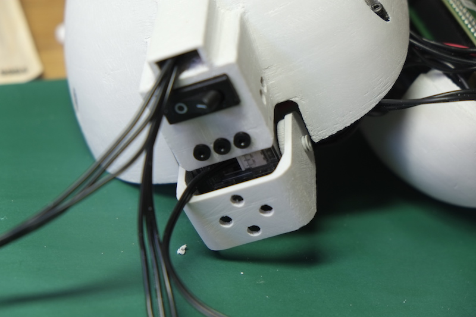

As well as two more on each side:

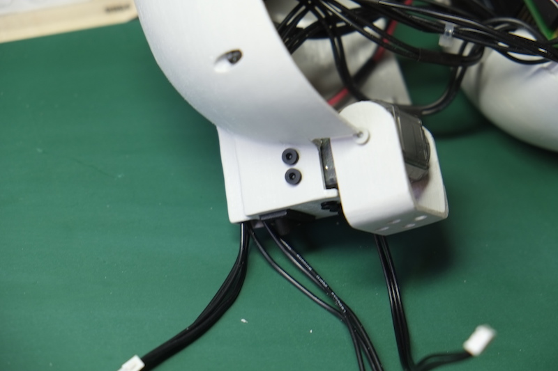

Connect all the cables between the two parts of the head: speakers to the power amplifier, power to the amplifier, power switch and the audio cable from the audio jack of the Rasbperry Pi:

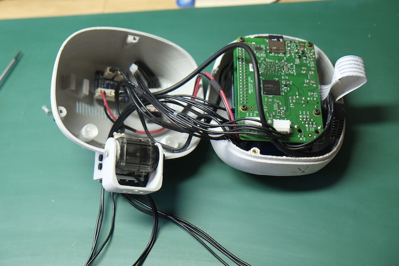

Guide the 2 long Dynamixel cables through the hole at the back of the neck behind the switch:

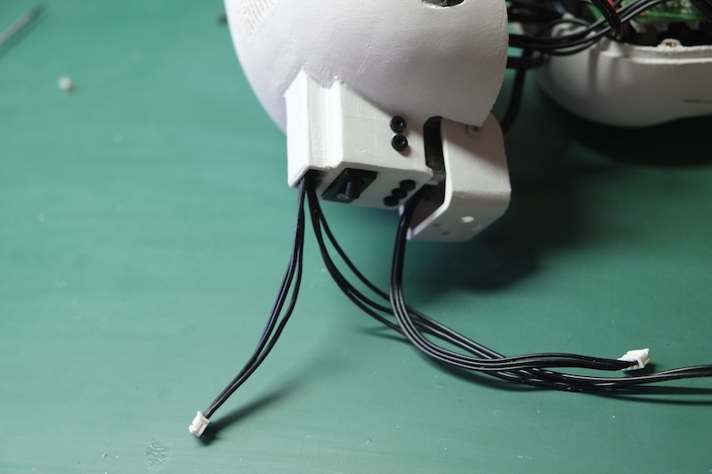

Gently close the head making sure that the cables do not misbehave and get into the way. In principle they should be micely through the middle of the head allowing you to align the holes with the screws and to secure eveything up:

Make sure the long Dynamixel cables are coming out as much as allowed and that they do not get tangled inside:

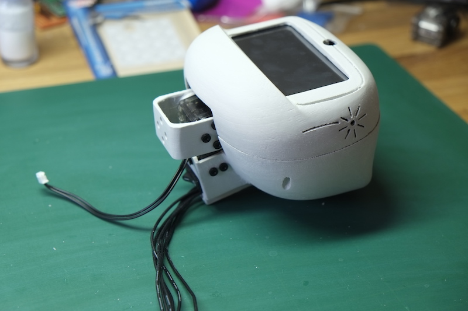

This is it! We now can start putting it all together in the next guide.
