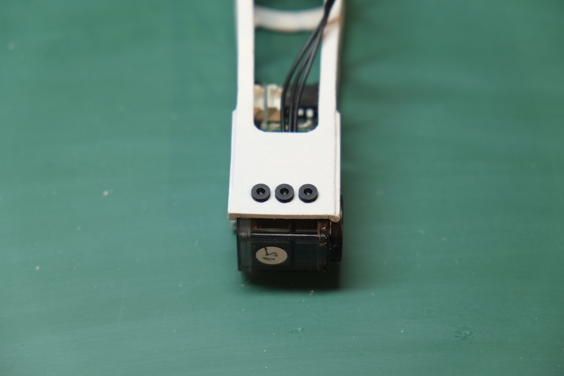
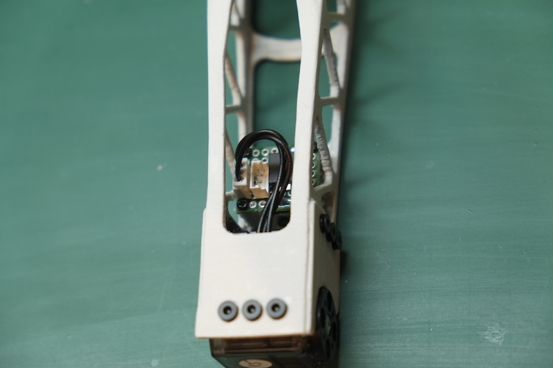
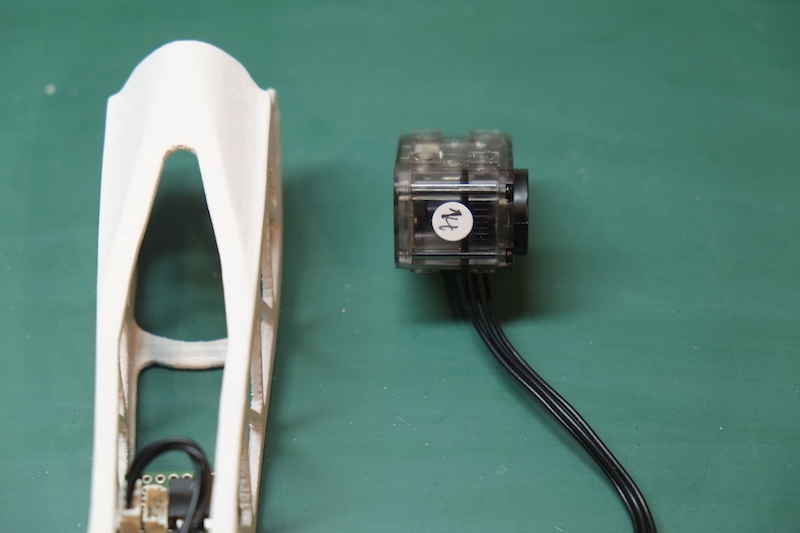

# Legs assembly

I will show you here only the assembly steps for the **left leg**. The right leg follows the same steps except that some parts are in mirror. I will give you the appropriate hints bellow when thee is someting you need to take care.

For the assembly of Poppy's left leg you will need:

1. The left foot
2. The left shin
3. The left thigh
4. One hip connector
5. The left hip
6. 4 Dynamixel XL-320 servos already configured with the IDs: 12, 13, 14 and 15 (for right leg they will be 22, 23, 24 and 25)
7. 3 Dynamixel cables - the standard ones that came with the servos
8. 1 160mm Dynamixel cable
9. 1 short Dynamixel cable - these are cables that were made from one standard XL-320 cable that was cut in two and connectors were added to the cut sides. Unlike the AX cables, Robotis does not sell cables shorter than 110mm for XL-320 and for some assemblies that is too long and can get in the way of other moving parts. We might try to see if it would be possible to produce some custom cables that can be commercialized in the future, but if you are really interested in robotics with Dynamixel servos it might be a good idea to invest in a relativelly unexpensive but reliable crimper and stripper. Alternativelly you can chose to use the standard 110mm cables instead of the shortered ones, but be careful obout how they are routed.
10. one hot-swap board; you can get the information about this board [here]
11. 40 2-step OLLO rivets
12. 2 3-step OLLO rivet
13. 4 M2x4mm self-tap screws (I'm using the ones from the Bioloid kit under the code S11 - but any self-tap screws that are 2mm in diameter should do it)

We will first secure in postion the hot-swap board on the shin using the 4 self-tap screws:

The  hot-swap board has on the back side two jumper pins that should be perfectly aligned with the hole in the shin's back. You can test that by using a LiPo battery pushing the power connector of the battery through the hole and making sure that is connects true with the pins in the hot-swap board. It would also be good to verify at this moment that this hole has preserved it's shape and allows you to connect the battery plug only one way around, preventing you to insert it the wrong way around:

Take the servo id 15 (25 for the right foot) and connect the short Dynamixel cable (or a normal one if you cannot make the shorter ones) as shown in the picture (for the right foot the servo will be facing the other way around - remember in the Poppy Seed the horns are always on the outside):

