# Legs assembly

I will show you here only the assembly steps for the **left leg**. The right leg follows the same steps except that some parts are in mirror. I will give you the appropriate hints bellow when there is someting you need to take care.

For the assembly of Poppy's left leg you will need:

1. The left foot
2. The left shin
3. The left thigh
4. One hip connector
5. The left hip
6. 4 Dynamixel XL-320 servos already configured with the IDs: 12, 13, 14 and 15 (for right leg they will be 22, 23, 24 and 25)
7. 3 Dynamixel cables - the standard ones that came with the servos
8. One 160mm Dynamixel cable
9. One short Dynamixel cable - these are cables that were made from one standard XL-320 cable that was cut in two and connectors were added to the cut sides. Unlike the AX cables, Robotis does not sell cables shorter than 110mm for XL-320 and for some assemblies that is too long and can get in the way of other moving parts. We might try to see if it would be possible to produce some custom cables that can be commercialized in the future, but if you are really interested in robotics with Dynamixel servos it might be a good idea to invest in a relativelly unexpensive but reliable crimper and stripper. Alternativelly you can chose to use the standard 110mm cables instead of the shortered ones, but be careful obout how they are routed.
10. One [hot-swap board](../../electronics/hotswap.md); you can get the information about this board [here]
11. 44 2-step OLLO rivets
12. 3 3-step OLLO rivet
13. 4 M2x4mm self-tap screws (I'm using the ones from the Bioloid kit under the code S11 - but any self-tap screws that are 2mm in diameter should do it)

We will first secure in postion the hot-swap board on the shin using the 4 self-tap screws:

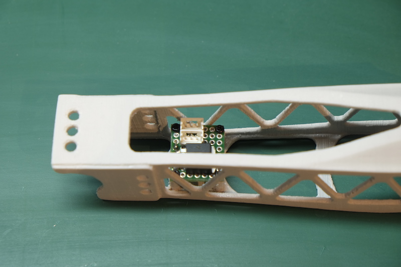

The  hot-swap board has on the back side two jumper pins that should be perfectly aligned with the hole in the shin's back. You can test that by using a LiPo battery pushing the power connector of the battery through the hole and making sure that is connects true with the pins in the hot-swap board. It would also be good to verify at this moment that this hole has preserved it's shape and allows you to connect the battery plug only one way around, preventing you to insert it the wrong way around:

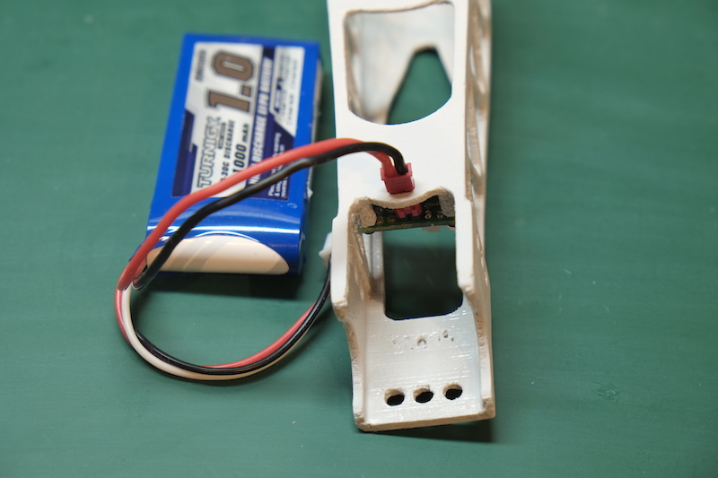

Take the servo id 15 (25 for the right foot) and connect the short Dynamixel cable (or a normal one if you cannot make the shorter ones) as shown in the picture (for the right foot the servo will be facing the other way around - remember in the Poppy Seed the horns are always on the outside):

Slide now the servo in the shin making sure that the horn is facing towards right (in the case of the right leg it will face left). Secure it in position using 3 rivets on the front side of the shin:

Then add 3 more rivets on the horn side:

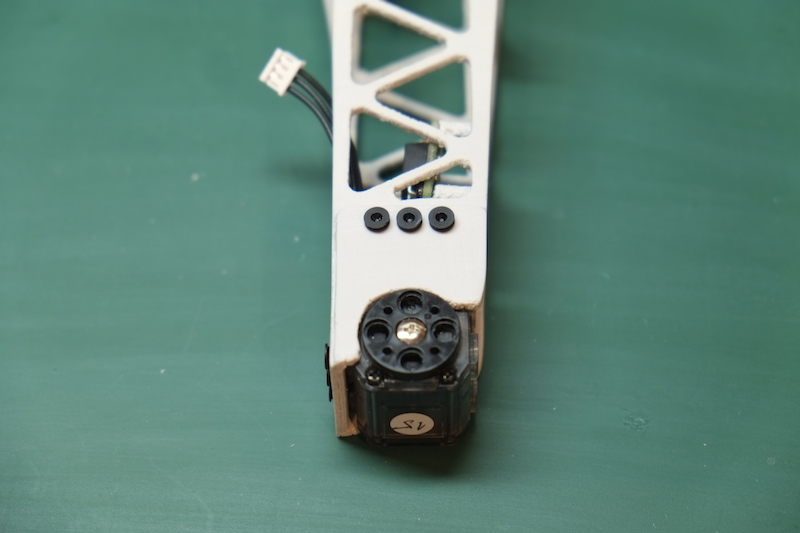

And another 3 on the idle side:

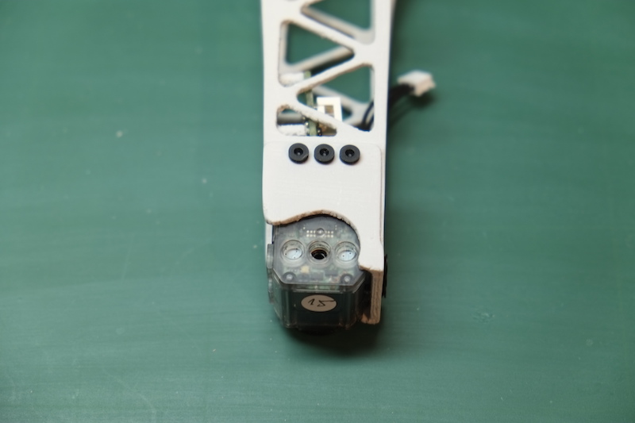

Connect the cable from the servo to the outermost connector from the hot-swap board:

Take now the servo 14 (or 24 for the right foot) and connect the backside conctor with a standard cable. The position of the servo is with the horn down and towards exterior (right for the left foot - the other way aqround for the right foot):

Place the servo in his position on the shin and secure it with 4 rivets to the horn:

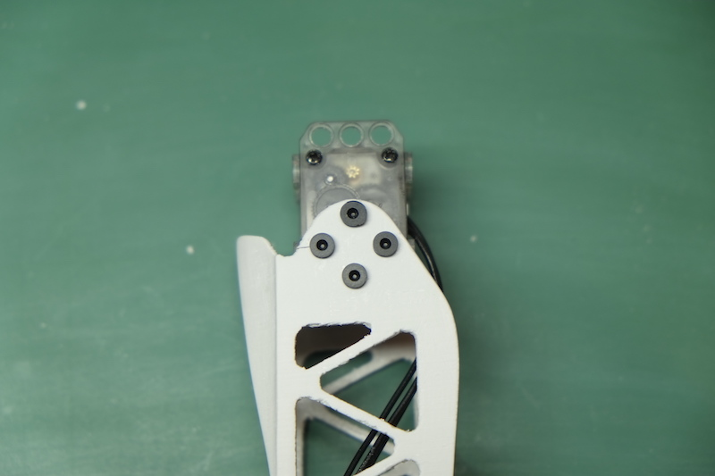

And one 3-step rivet on the idle side:

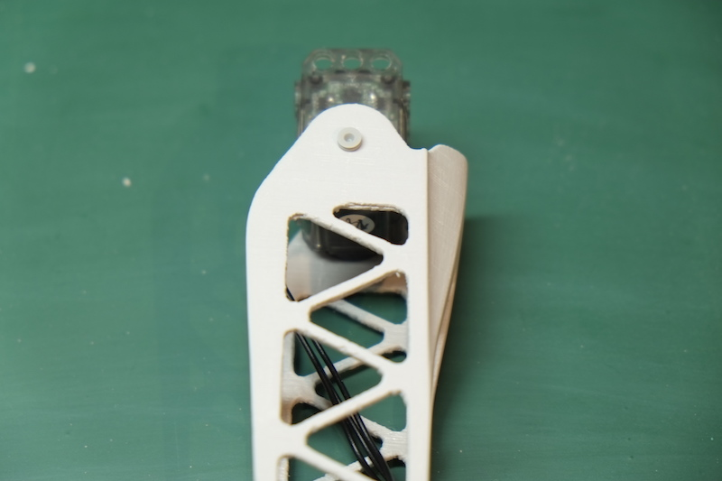

Connect the cable from this servo to the free connector in the hot-swap board:

Take the 160mm cable and connect it on the front connector of the knee servo as seen in the picture:

Slide the thigh over the servo and secure with 3 rivets on one side:

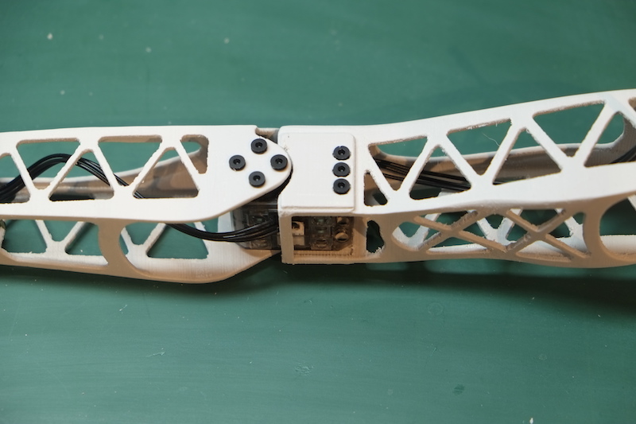

And 3 more rivets on the other side:

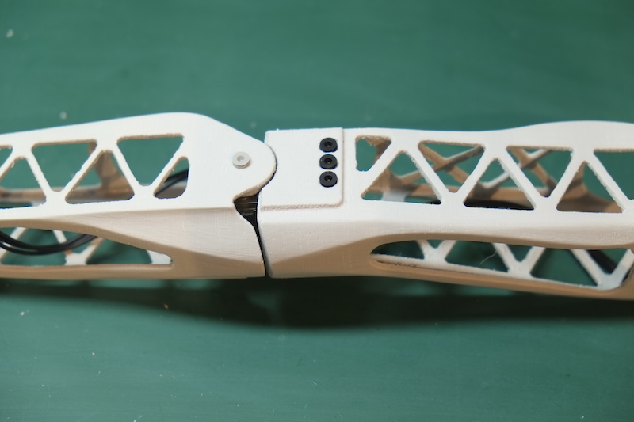

Take the servo 12 (22 for the right foot) and connect the 2 remaining standard cables directing them towards the back of the servo:

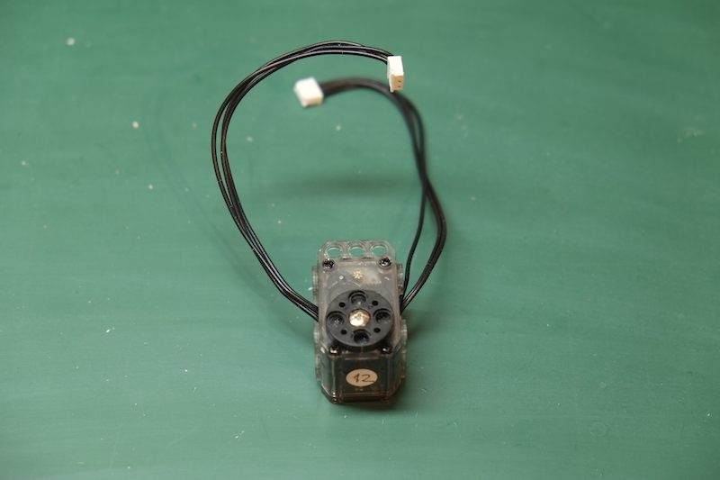

Carefully slide the servo in the hip making sure that the horn ends up in the hole and the cables are exiting the back of the hip. Make sure that the horn is set to 0 before doing this: it is quite difficult to see the markings on the horn once in position because there is relatively little clearance between the horn and the hip hole:

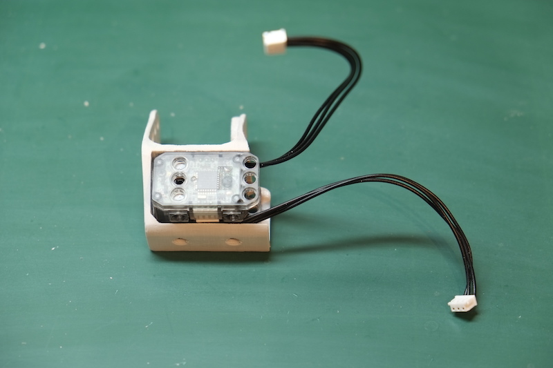

Secure the servo in position with 2 rivets on the side:

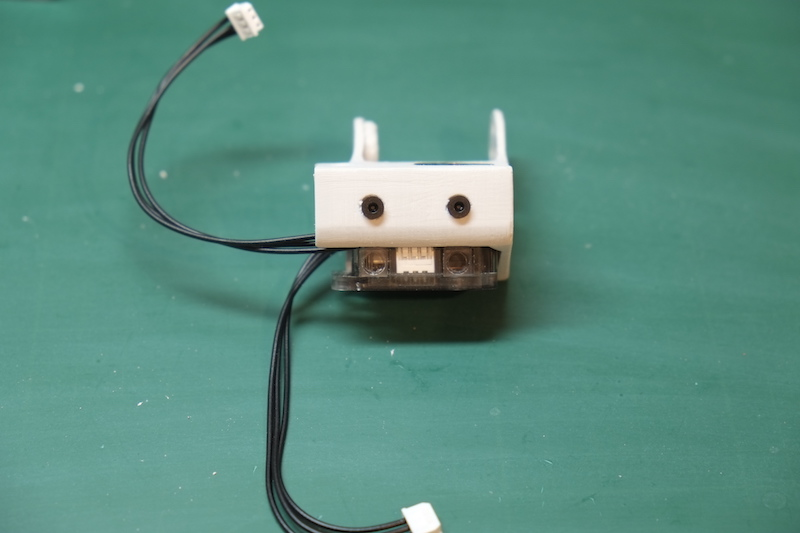

3 more rivets on the other side:

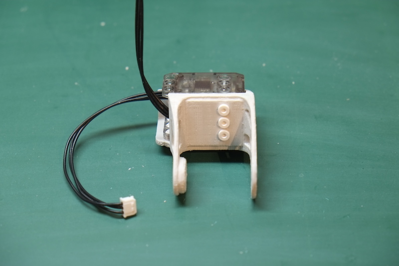

And 3 more rivets on the underside:

Place the hip connector part on the horn of the servo and secure it with 4 rivets as seen in the picture:

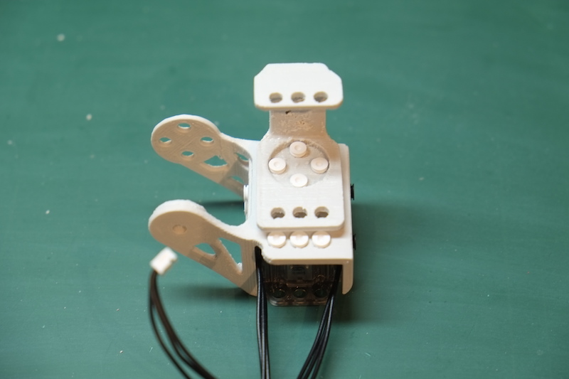

Take the cable that is on the exterior of the hip and connect it to the upper connector of the servo 13 (23 for the right leg). The servo 13 will be positioned with (you guessed it...) the horn outside:

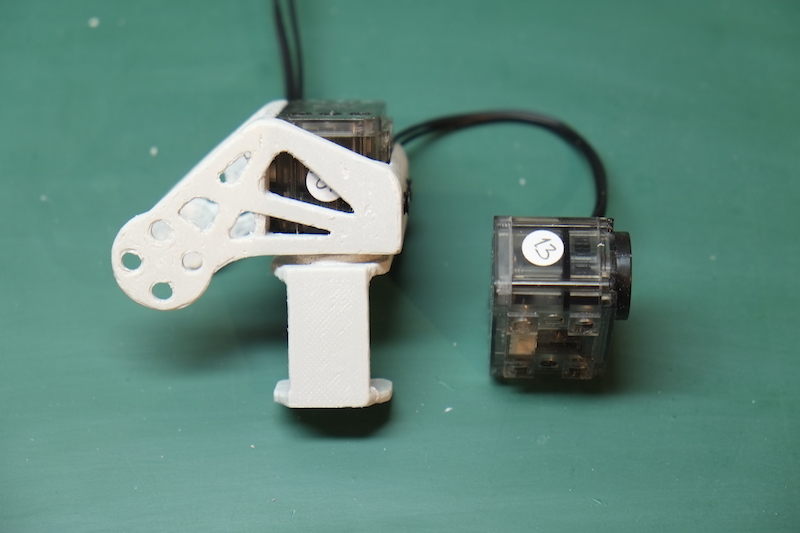

Slide the servo 13 into the hip connector and then secure it with 3 rivets on the underside:

Rotate the hip conector 90 degrees so that the holes on the upper part become accessible and add two more rivets on the upper part (the one in the middle stays empty because the cable):

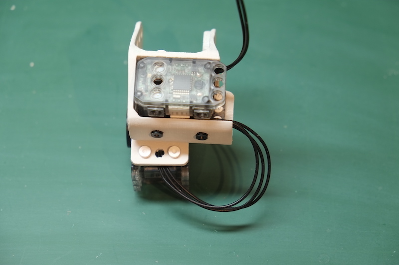

Rotate the hip connector back in the normal position and connect now the horn of the servo 13 with the thigh securing it with 4 rivets:

And a 3-step rivet on the idle side:

Rotate the thigh so that the underside connector of the servo 13 is accessible and connect the long cable coming from the knee to this servo:

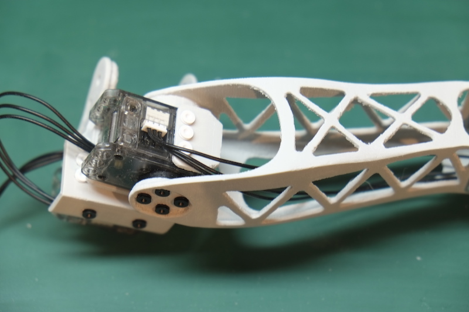

Now connect the left foot to the servo 15 using 4 rivets on the horn side:

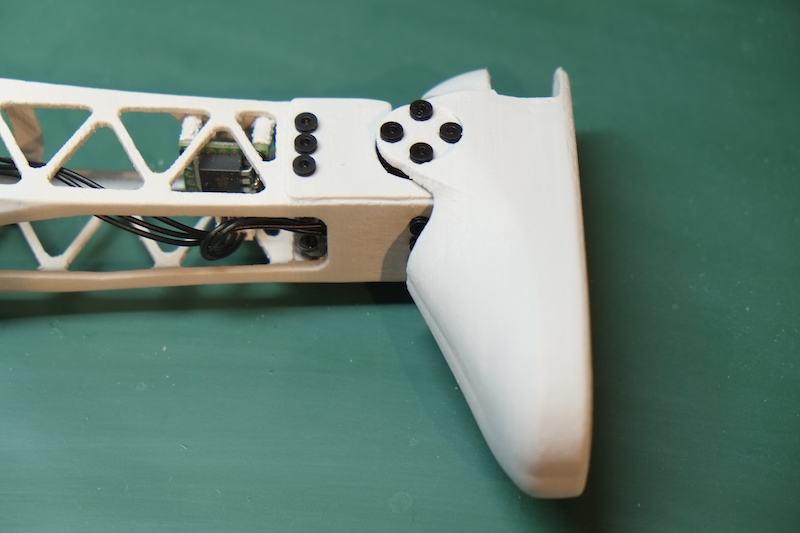

And a 3-step connector on the idle side:

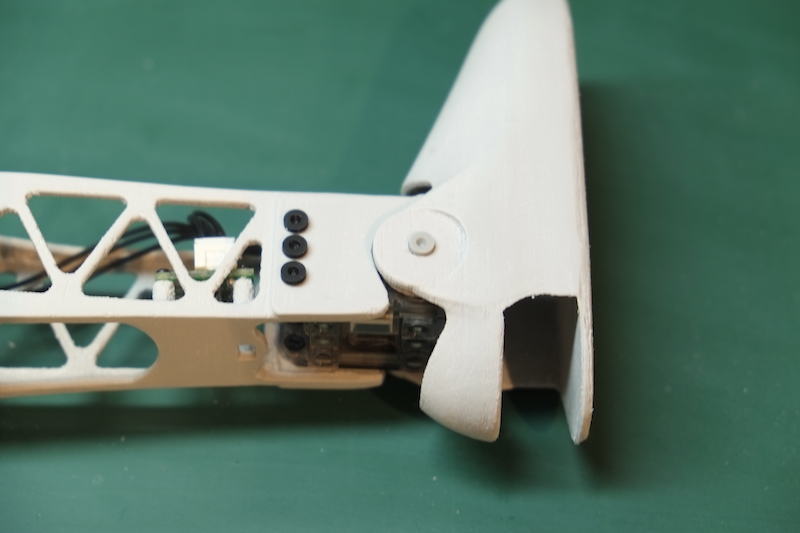

Congratulations, you have finished the assembly of the left foot. The pelvis will be connected later in the final assembly.

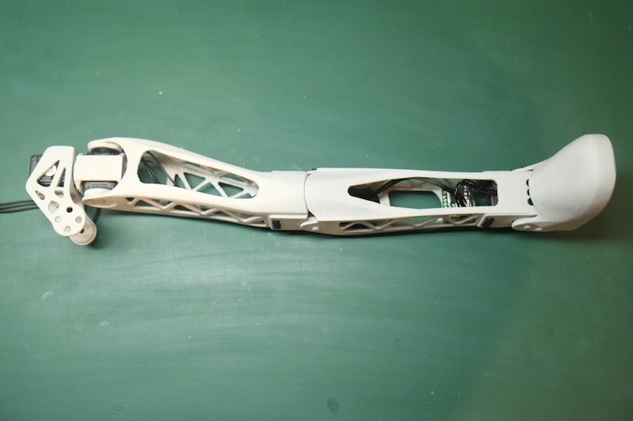
