# Torso Assembly

To assembly the Poppy Seed torso you will need the following:

* The 3D printed Chest
* The 3D printed Spine
* The 3D printed Abdomen
* One XL-320 combo (dual) for the upper torso with the servo IDs 34 and 35. Please follow [this guide](dualXL.md) for details about how to put this together.
* One XL-320 combo (dual) for the lower torso with the servo IDs 31 and 32. Use the same guide but please make sure you use the indicated 160mm cable in the assembly
* 4 Dynamixel XL-320 with the IDs: 33 (spine), 36 (neck Z), 41 (left shoulder) and 51 (right shoulder)
* 2 110mm Dynamixel cables (the ones that come standard with the servo)
* 3 160mm Dynamixel calble
* 38 2-step OLLO rivets
* 3 3-step OLLO rivets

Start by adding one long (160mm) and one normal cable to the servo 41 (left shoulder):

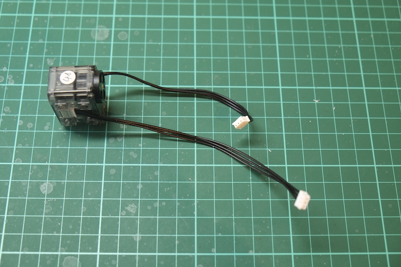

Since this is the left shoulder it will be mounted on the right as we look forward at the chest. The horn will face towards outside - so right - and the long cable will be connected to the underside of the servo while the normal cable to the upper side as you can see in the picture.

Now slide the servo in position in the chest one the right side as we look at the chest from front. The upper cable should be directed between the servo's supports:

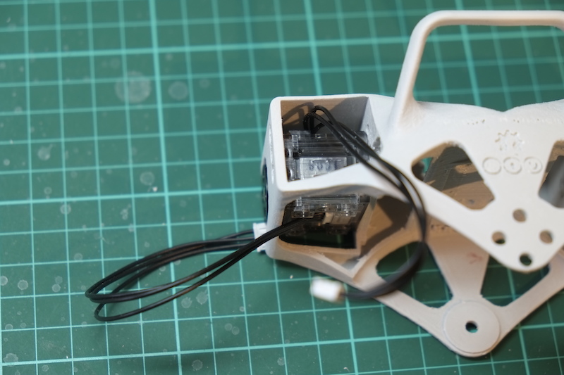

Secure the servo in position with three rivets on the outside:

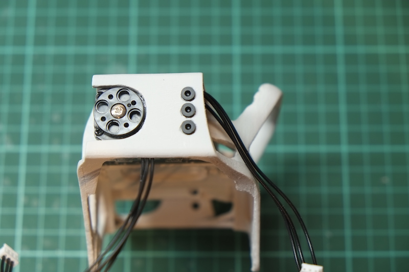

And add four more rivets on the inside of the chest:

Guide the longer (underside) cable through the hole in the chest and pull it out through the cetral hole:

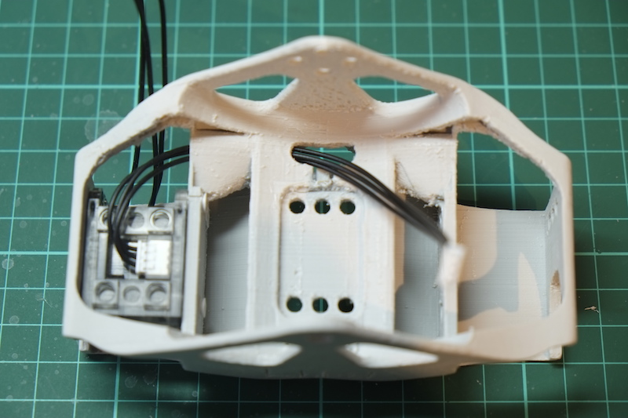

Repeat the process with the right shoulder servo (51) making sure that they are in mirror. The underside should use the longer cable and the upperside the normal cable. Slide the servo in position:

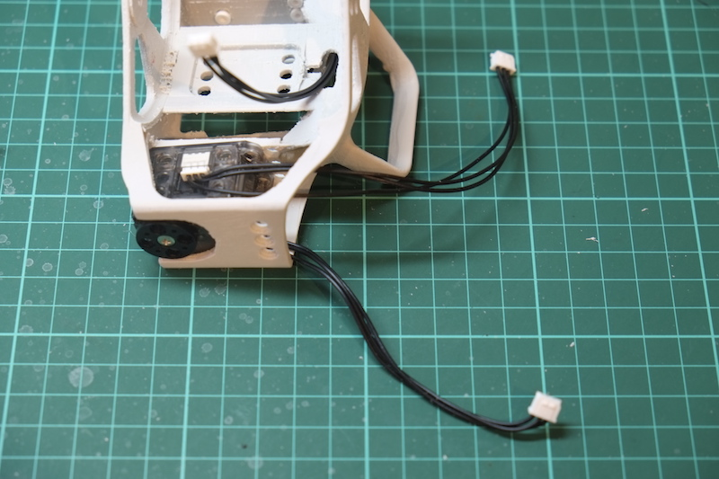

Then secure it with 3 rivets on the outside and 4 on the inside in the same way we have done for the left shoulder. Guide the underside cable through the hole in the chest and pull it through the cetre hole:

Place the servo 36 (neck) on top of the chest:

And secure it from bellow with 6 rivets as shown in the following picture:

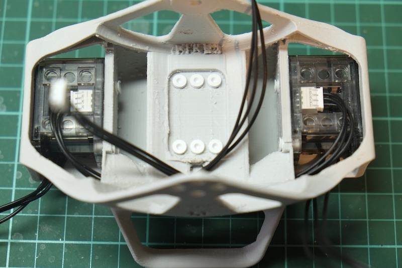

Take the upper XL combo and guide the longer cable through the centre hole in the chest towards the servo 36:

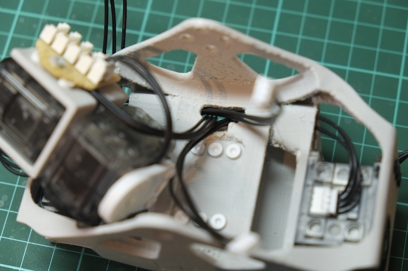

Pull that cable out on the top of the chest next to the servo 36:

And connect it to one side of the servo 36:

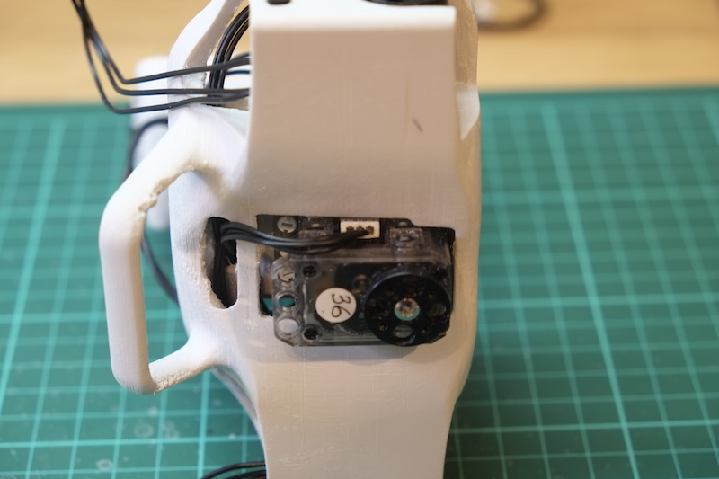

Now secure the combo on the chest using 4 2-step rivets to secure the horn:

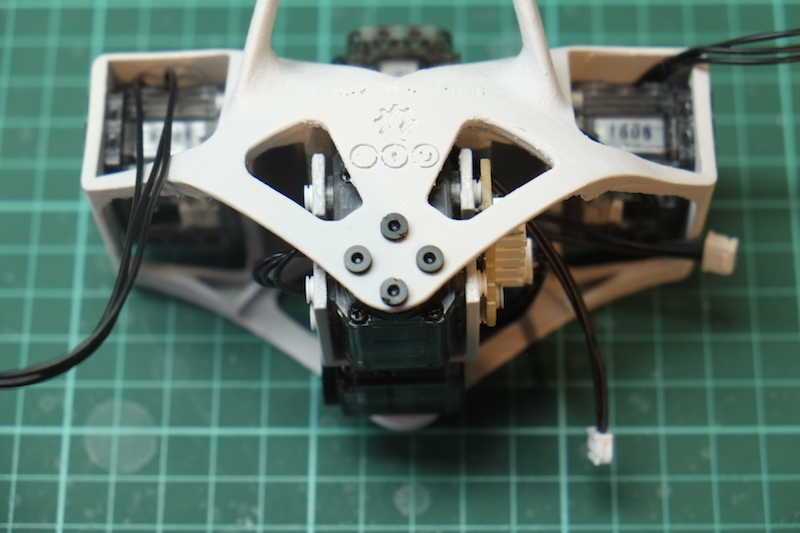

And one 3-step rivet on the other side:

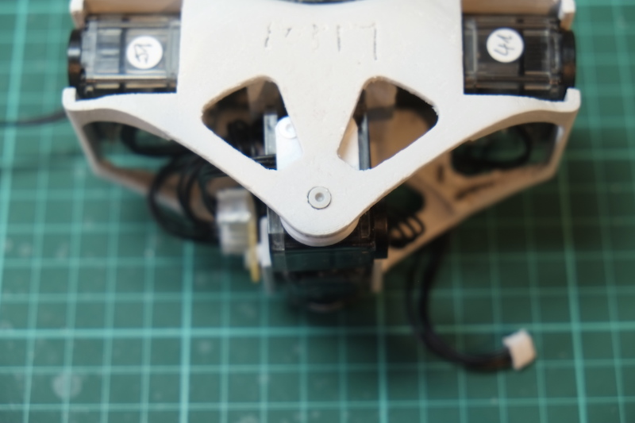

Connect now the two cables coming from the shoulders (through the channels and the central hole in the chest) to the two back most connectors in the hub:

Put the assembled chest to the side and take the abdomen and the servo with ID 33. Place it on top of the abdomen as in the following picture:

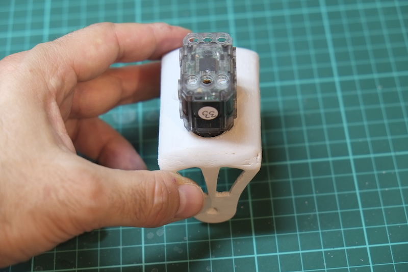

Secure it in position with 4 rivets:

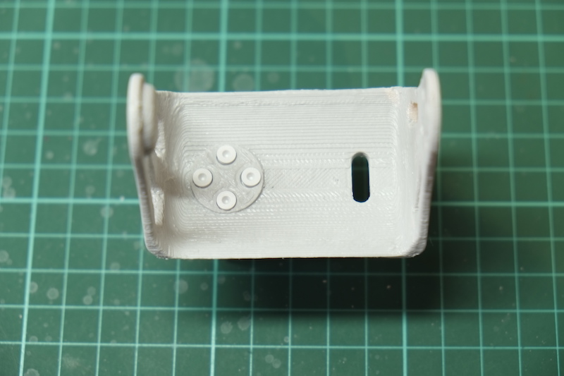

Take the lower XL combo and slide the longer cable through the hole in the abdomen:

Use four rivets to secure the lower combo horn with the abdomen:

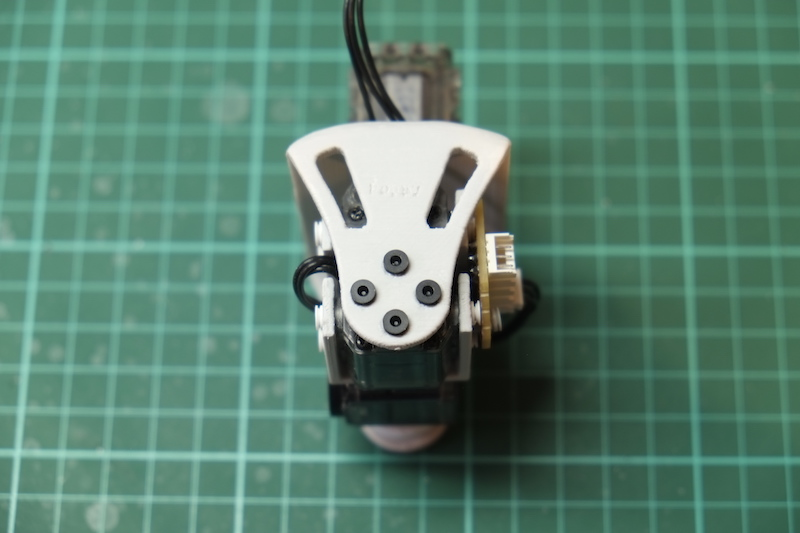

And one 3-step rivet on the other side:

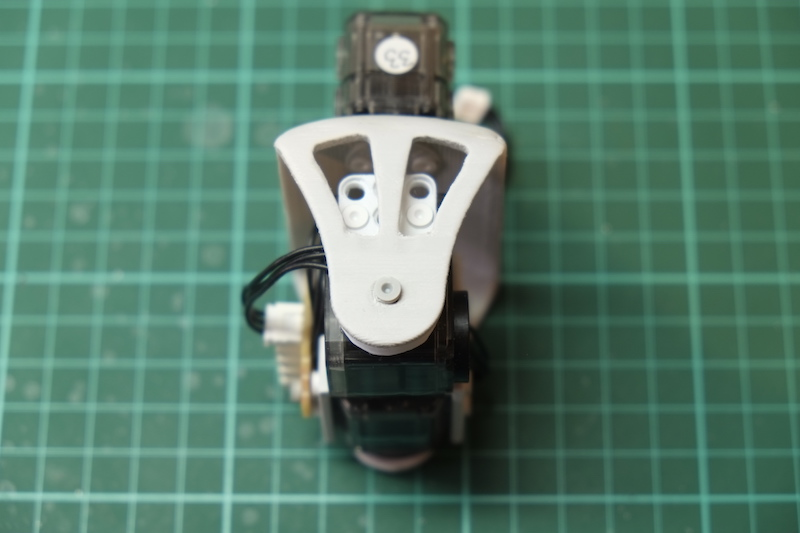

Connect the cable to the servo on the spine (ID 33) - it doesn't matter on which side you will connect it:

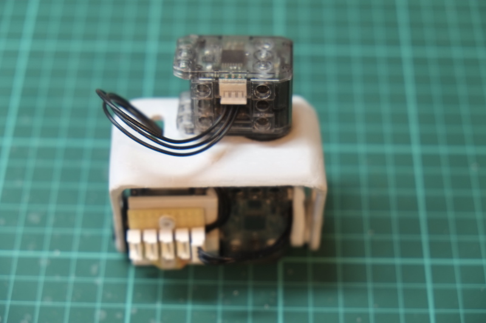

Now slide the spine in position from the front of the servo towards the back until the holes are aligned.

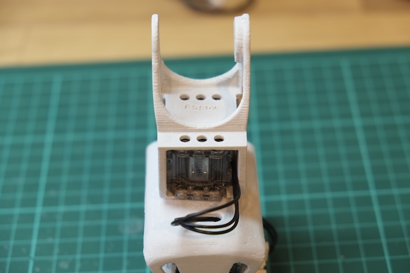

Secure the servo in position using six rivets:

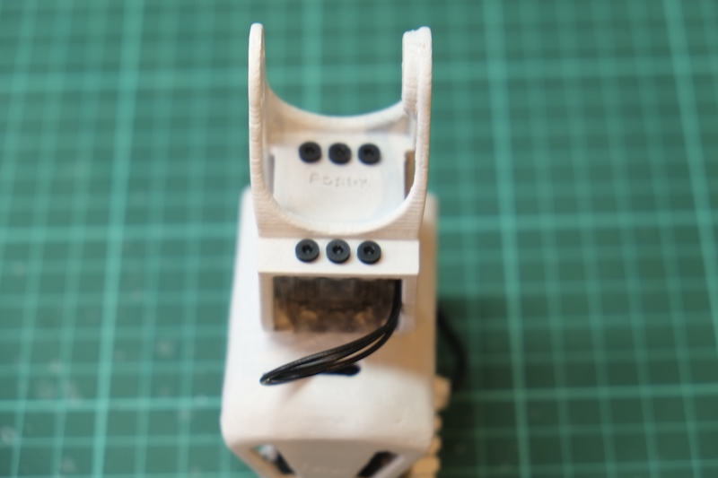

You can now combine the lower part of the torso with the upper part. Place the upper part Y axis servo in position between the spine's holders and fix it with four rivets one the horn side:

And one 3-step rivet on the the other side:

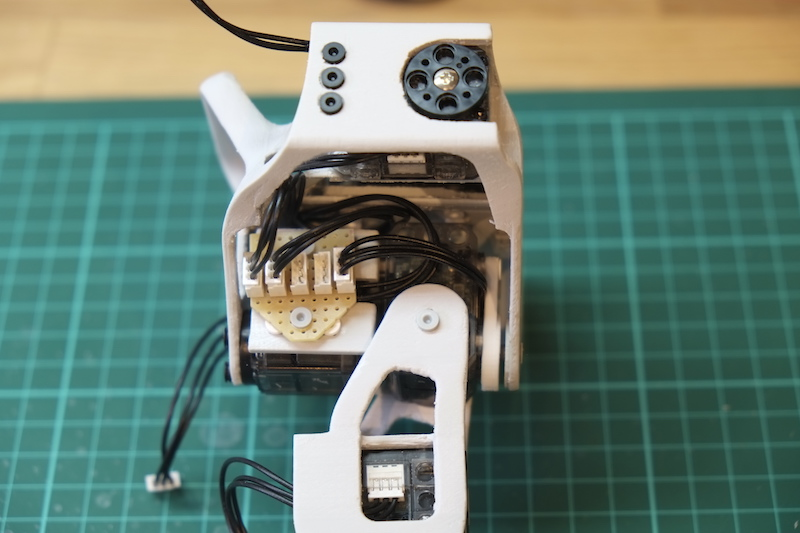

Take the last remaining 160mm cable and cut the Data wire. Look carefully at the position of the connector and cut the same cable on the outside (the picture is of a cable made by myself - but it is easier if you use a standard 160mm cable and cut the Data cable). The reason we are cutting the Data cable is that we want to isolate the upper part of the body from the lower part in the case we are able to use a controller that has 2 channels. But we need to cable to improve the power transmission from the legs (that have the batteries) to the upper body.

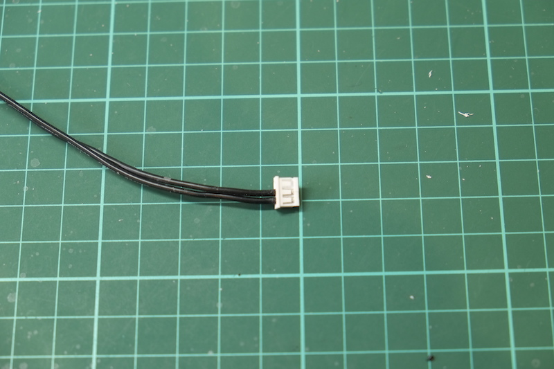

Connect this cable to the middle coonnector in both hubs and guide it through the abdomen hole:

Your Poppy Seed abdomen is now ready!

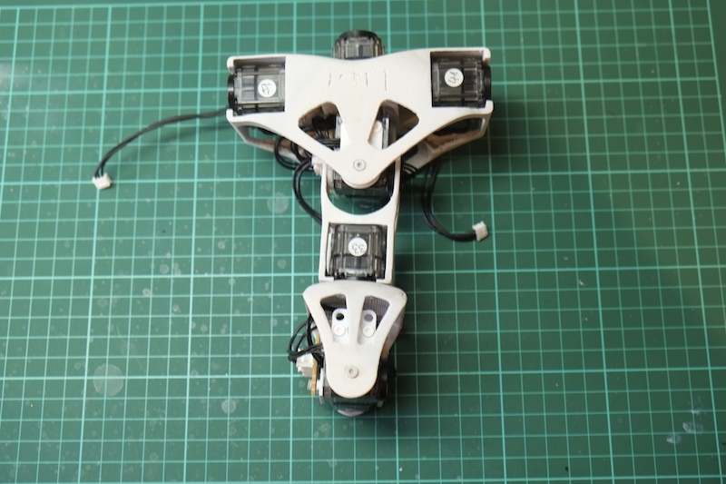
